# Status of CDS in 2023

<center><i>DRAFT - ROUGH - DRAFT - ROUGH - DRAFT</i></center>

## 1. Introduction

### 1.1 What is CDS

<blockquote>

CDS, historically an acronym for Class Data Sharing, was introduced in JDK 1.5 around 2005
with the following two goals

- Faster start-up: by pre-processing Java classes ahead of time, we can reduce the time
  spent in class loading when the application starts up.
- Lower memory usage: the pre-processed Java classes are stored in an image file that
  can be memory-mapped and shared across processes to reduce overall memory usage.

While the name Class Data Sharing alludes only to the second goal, as memory has
become drastically cheaper and more abundant, the benefit of memory saving has become
less important. On the other hand, the increasing popularity of micro-services has made
the first goal, faster start-up, ever more important.

In the rest of the document, the word "CDS" is used to describe the current
system in HotSpot in 2023 for pre-processing Java classes and their instances.
It should not be treated as an acronym anymore.
</blockquote>

In the rest of this document ...

- In Section 2, we will first see some brief examples to illustrate how CDS can be
  used to improve the performance of your Java application. We'll also see a breakdown of the
  various optimizations provided by CDS.

- CDS has been improving over the years and has become quite complicated. In Section 3, we will look at
  the current implementation of CDS.

- Looking ahead, CDS is likely to be one of the foundation blocks for [Project Leyden](https://openjdk.org/projects/leyden/).
  In Section 4, I will describe some possible ways for CDS to evolve to support more ahead-of-time processing
  of Java applications to improve start-up time.

## 2. Using CDS in Your Applications

Note: detailed information about using CDS, including the various JVM and jcmd options, can be found here:
https://docs.oracle.com/en/java/javase/20/docs/specs/man/java.html#application-class-data-sharing

In this document, we will focus on one use case (javac) so you can understand what CDS is
and how its optimizations are applied to improve the start-up of Java applications.

### 2.1 Baseline Performance of javac

CDS is most beneficial for short running applications that load a fair number of classes. One such
example is javac, the Java Compiler.

To measure the start-up of javac, we can do something like this:

```
$ cat > Hello.java <<EOF
class Hello {
    public static void main(String args[]) {
        System.out.println("Hello");
    }
}
EOF
$ perf stat -n -r 40 javac Hello.java
        0.28140 +- 0.00163 seconds time elapsed  ( +-  0.58% )
```

If we want to specify JVM options for javac, we could use the syntax like `-J-XX:SharedArchiveFile=javac.jsa`,
but it's more convenient to directly run its main class, `com.sun.tools.javac.Main`.

So here's our baseline number: when launching with its main class, javac takes about 260ms to compile Hello.java.

```
$ perf stat -n -r 40 java com.sun.tools.javac.Main Hello.java
        0.259218 +- 0.000798 seconds time elapsed  ( +-  0.31% )
```

Note that this is even faster than using the "javac" program. This is due to the difference
in CDS full module graph handling, which we will describe later. (TODO)

In the above execution, we are already using CDS -- since JDK 17, a "default CDS archive" is included
in the JDK and includes about 1000 commonly used system classes. If we disable CDS altogether, you can
see that performance gets worse:

```
$ perf stat -n -r 40 java -Xshare:off com.sun.tools.javac.Main Hello.java
        0.29615 +- 0.00162 seconds time elapsed  ( +-  0.55% )
```

### 2.2 Building a Static CDS Archive for javac

To make javac start even faster, we can create a CDS archive specific for javac.
There are several ways of creating CDS archives. The first one is call a <b>Static CDS Archive</b>, which is
created using the `-Xshare:dump` JVM option:

We first perform a "training run" to understand what classes are used by javac:


```
$ java -Xshare:off -XX:DumpLoadedClassList=javac.classlist com.sun.tools.javac.Main Hello.java
$ wc -l javac.classlist
2414 javac.classlist
```

The next step is to create the CDS archive using `javac.classlist`:

```
$ java -Xshare:dump -XX:SharedClassListFile=javac.classlist -XX:SharedArchiveFile=javac.jsa
$ ls -l javac.jsa
-r--r--r-- 1 iklam iklam 21630976 May 24 11:07 javac.jsa
```

Now, you can run javac with this new CDS archive:

```
$ perf stat -n -r 40 java -XX:SharedArchiveFile=javac.jsa com.sun.tools.javac.Main Hello.java
        0.152728 +- 0.000670 seconds time elapsed  ( +-  0.44% )
```

You can see that the performance is <b>almost twice as fast when compared to the 296ms where
CDS is disabled. It's also about 30%, or about 100ms, faster than when only the default

```mermaid
gantt
    title Elapsed time (ms) for "javac Hello.java"
    todayMarker off
    dateFormat  X
    axisFormat %s

    No CDS Archive   : 0, 296
    Default CDS Archive   : 0, 259
    Static CDS Archive for javac   : crit, 0, 152
    Dynamic CDS Archive for javac   : 0, 158
```

CDS archive is used</b>.




### 2.3 Building a Dynamic CDS Archive for javac

You can also create an alternative form of archive called the <b>Dynamic CDS Archive</b>, using the
`-XX:ArchiveClassesAtExit` JVM option:

```
$ java -XX:ArchiveClassesAtExit=javac-dyn.jsa com.sun.tools.javac.Main Hello.java
$ ls -l javac-dyn.jsa
-r--r--r-- 1 iklam iklam 10440704 May 24 13:22 javac-dyn.jsa
$ perf stat -n -r 40 java -XX:SharedArchiveFile=javac-dyn.jsa com.sun.tools.javac.Main Hello.java
        0.157842 +- 0.000503 seconds time elapsed  ( +-  0.32% )
```

The difference between static and dynamic archives are:

- The dynamic archive can be created easily in a single step, but the static archive needs two steps
- The dynamic archive is smaller:
    - The dynamic archive is layered on top of the default CDS archive (`$JAVA_HOME/lib/server/classes.jsa`), so
      it contains only classes that are not already in the default archive.
- The performance of the dynamic archive is slightly slower as there's more overhead when
  using it together with the default archive.
- The creation of the static archive is more customizable -- you can modify the classlist as needed to
  store more or fewer classes.

### 2.3 Loading Regular Classes from the CDS Archive

To see how the classes are loaded, let's first capture two log files using `-Xlog:class+load`,
and compare the results with CDS on vs off:

```
$ java -XX:SharedArchiveFile=javac.jsa -Xlog:class+load::none com.sun.tools.javac.Main Hello.java > withcds.log
$ java -Xshare:off -Xlog:class+load::none com.sun.tools.javac.Main Hello.java > nocds.log
$ wc -l *cds.log
  2346 nocds.log
  2291 withcds.log
```

We can see that with CDS, fewer classes are loaded. The reasons are:

- When CDS is enabled, we can skip parts of the JDK library initialization code.
  For example, the module graph is archived (see [JDK-8244778](https://bugs.openjdk.org/browse/JDK-8244778)),
  so we don't need to load the classes that are used in the module graph creation.
- When CDS is enabled, Lambda Proxy classes are loaded from the archive, so we don't need to
  load some classes that are used only for generating these proxy classes.

To see the difference between the two logs, we should filter out the
generated classes (which have `/0x` in their names, see below) and look
at only the regular classes


```
$ diff w n | grep -v '^[0-9]'
< java.lang.Byte$ByteCache
> java.lang.invoke.InnerClassLambdaMetafactory$ForwardingMethodGenerator
> java.lang.invoke.TypeConvertingMethodAdapter
> java.lang.ModuleLayer$Controller
> java.lang.module.ModuleDescriptor$Modifier
> java.lang.NamedPackage
> java.lang.NoSuchMethodError
> java.lang.reflect.AccessFlag
> java.lang.reflect.AccessFlag$1
[...snip...]
> java.lang.reflect.AccessFlag$9
> java.lang.reflect.AccessFlag$Location
< java.lang.Short$ShortCache
> java.util.AbstractMap$1
> java.util.AbstractMap$1$1
< java.util.jar.Attributes$Name
< jdk.internal.math.FDBigInteger
> jdk.internal.module.Builder
> jdk.internal.module.ModuleHashes$Builder
> jdk.internal.module.ModuleLoaderMap
> jdk.internal.module.ModuleLoaderMap$Modules
> jdk.internal.module.ModuleResolution
> jdk.internal.module.SystemModules
> jdk.internal.module.SystemModules$default
> jdk.internal.module.SystemModulesMap
```

Also, you can see that when CDS is enabled, classes are loaded (in their final optimized form)
from the "shared objects file", which is just another name for the CDS archive. This
is much faster than reading the class files from the `jtr:/` file system and perform
expensive processing before these classes can be executed by the JVM.

```
$ grep java.lang.Object *.log
nocds.log:java.lang.Object source: jrt:/java.base
withcds.log:java.lang.Object source: shared objects file
```

### 2.4 Generated Classes: Lambda Proxy

Lambda proxy classes are generated to handle [lambda expressions](https://docs.oracle.com/javase/tutorial/java/javaOO/lambdaexpressions.html) in Java classes. You can look for them with this pattern in the log file:

```
$ grep Lambda/0x nocds.log
java.util.regex.CharPredicates$$Lambda/0x00000007c00189c8 source: java.util.regex.CharPredicates
com.sun.tools.javac.main.Option$$Lambda/0x00000007c000d6d8 source: com.sun.tools.javac.main.Option
...
$ grep Lambda/0x nocds.log  | wc -l
170
```

The patterns like `source: java.util.regex.CharPredicates` indicate that these
lambda proxy classes are dynamically generated at runtime. Modern Java
applications tend to use more lambda expressions. In the cases of our javac test,
170 of these classes are dynamically generated, causing significant slow down.

With CDS, the lambda proxy classes are pre-generated and stored inside the archive:

```
$ grep Lambda/0x withcds.log
java.util.regex.CharPredicates$$Lambda/0x800000004 source: shared objects file
com.sun.tools.javac.main.Option$$Lambda/0x800000009 source: shared objects file
...
```

To see how much time is saved by pre-generating the lambda proxy classes, we can exclude them
from the static archive:

```
$ grep -v @lambda-proxy javac.classlist  > javac-nolp.classlist
$ java -Xshare:dump -XX:SharedClassListFile=javac-nolp.classlist -XX:SharedArchiveFile=javac-nolp.jsa
$ perf stat -n -r 40 java -XX:SharedArchiveFile=javac-nolp.jsa com.sun.tools.javac.Main Hello.java
        0.168135 +- 0.000905 seconds time elapsed  ( +-  0.54% )
```

That's about 16 ms slower than when lambda proxy classes are pre-generated.

### 2.5 Generated Classes: LambdaForm

The JVM also generates another type of classes called LambdaForms to support
[`invokedynamic`](https://blogs.oracle.com/javamagazine/post/understanding-java-method-invocation-with-invokedynamic),
which is used in the implementation of many modern features of the JDK.

You can look for them with this pattern in the log files:

```
$ grep MH/0x nocds.log
java.lang.invoke.LambdaForm$MH/0x00000007c0080000 source: __JVM_LookupDefineClass__
java.lang.invoke.LambdaForm$MH/0x00000007c0080400 source: __JVM_LookupDefineClass__
...
$ grep  MH/0x nocds.log | wc -l
32
$ grep  MH/0x withcds.log | wc -l
9
```

You can see that when CDS is used, fewer LambdaForm classes are generated at runtime.
More details about this optimization can be found in [JDK-8247536](https://bugs.openjdk.org/browse/JDK-8247536).
The implementation details are also discussed below in section 3.X (TODO).

The benefit of this optimization is rather minor for javac. It saves about 5 ms:

```
$ grep -v @lambda-form javac.classlist > javac-nolf.classlist
$ java -Xshare:dump -XX:SharedClassListFile=javac-nolf.classlist -XX:SharedArchiveFile=javac-nolf.jsa
$ perf stat -n -r 40 java -XX:SharedArchiveFile=javac-nolf.jsa com.sun.tools.javac.Main Hello.java
          0.157576 +- 0.000835 seconds time elapsed  ( +-  0.53% )
```

### 2.6 CDS and Bytecode Verification

Part of the CDS saving is from performing bytecode verification ahead of time.
Bytecode verification is needed to ensure that Java bytecodes are valid and will not
perform illegal actions such as accessing arbitrary memory locations. Unfortunately,
bytecode verification can be a slow process because it performs complex checks.

To see how much time is spent in bytecode verification for javac, we can do this:


```
$ perf stat -n -r 40 java -Xshare:off com.sun.tools.javac.Main Hello.java
        0.29615 +- 0.00162 seconds time elapsed  ( +-  0.55% )
$ perf stat -n -r 40 java -Xshare:off -Xverify:none com.sun.tools.javac.Main Hello.java
        0.254782 +- 0.000977 seconds time elapsed  ( +-  0.38% )
```

So we can see that bytecode verification takes about 40ms for all the classes used by javac.

A frequently asked question is -- instead of CDS, can I just disable verification? The answer is NO:

- First of all, `-Xverify:none` removes one level of security defense and makes your application
  more vulnerable to attacks. Also, `-Xverify:none` is a deprecated flag and may be removed
  from the JDK.
- CDS does not disable bytecode verification. It performs bytecode verification ahead of time
  and save the results in the archive. Part of the saved results (class verification constraints) are used
  to verify the safety of new classes that are parsed and loaded at run time.
- As the above numbers show, disabling verification only gives you a small portion of the
  benefits that can be achieved with CDS.


## 3. The Implementation of CDS

### 3.0 The Contents of the CDS Archive

Here are a few logging options for examining the contents of the
CDS archive. The subsequent sections will describe how the contents are
written into the archive during dump time, and how they are used during
runtime.


```
$ java -Xshare:dump -Xlog:cds=debug::none -Xlog:cds+map=trace:file=cds.map:none:filesize=0
[...]
Number of classes 1501
    instance classes   =  1388
      boot             =  1388
      app              =     0
      platform         =     0
      unregistered     =     0
      (hidden)         =    71
      (unlinked)       =     0
    obj array classes  =   104
    type array classes =     9
[...]
rw space:   4749288 [ 32.5% of total] out of   4751360 bytes [100.0% used] at 0x0000000800000000
ro space:   8508120 [ 58.3% of total] out of   8511488 bytes [100.0% used] at 0x0000000800488000
bm space:    252808 [  1.7% of total] out of    252808 bytes [100.0% used]
hp space:   1074624 [  7.4% of total] out of   1074624 bytes [100.0% used] at 0x00007fd342913870
total   :  14584840 [100.0% of total] out of  14591424 bytes [100.0% used]
Detailed metadata info (excluding heap region):
                        ro_cnt   ro_bytes     % |   rw_cnt   rw_bytes     % |  all_cnt  all_bytes     %
--------------------+---------------------------+---------------------------+--------------------------
Class               :        0          0   0.0 |     1501     951544  20.0 |     1501     951544   7.2
Symbol              :    41650    1669304  19.6 |        0          0   0.0 |    41650    1669304  12.6
TypeArrayU1         :    12474     377040   4.4 |     2776     298392   6.3 |    15250     675432   5.1
TypeArrayU2         :     2143      90680   1.1 |        0          0   0.0 |     2143      90680   0.7
TypeArrayU4         :     1666     101136   1.2 |        0          0   0.0 |     1666     101136   0.8
TypeArrayU8         :     2524     221712   2.6 |     1388     164192   3.5 |     3912     385904   2.9
TypeArrayOther      :        0          0   0.0 |      155      13864   0.3 |      155      13864   0.1
Method              :        0          0   0.0 |    21682    1915632  40.3 |    21682    1915632  14.4
ConstMethod         :    21682    3318008  39.0 |        0          0   0.0 |    21682    3318008  25.0
MethodData          :        0          0   0.0 |        0          0   0.0 |        0          0   0.0
ConstantPool        :     1388    2211040  26.0 |        0          0   0.0 |     1388    2211040  16.7
ConstantPoolCache   :        0          0   0.0 |     1388    1354752  28.5 |     1388    1354752  10.2
Annotations         :      125       4000   0.0 |        0          0   0.0 |      125       4000   0.0
MethodCounters      :        0          0   0.0 |        0          0   0.0 |        0          0   0.0
SharedClassPathEntry:        0          0   0.0 |        1         40   0.0 |        1         40   0.0
RecordComponent     :       17        408   0.0 |        0          0   0.0 |       17        408   0.0
SymbolHashentry     :    41650     329624   3.9 |        0          0   0.0 |    41650     329624   2.5
SymbolBucket        :    10800      43208   0.5 |        0          0   0.0 |    10800      43208   0.3
StringHashentry     :     7641      60536   0.7 |        0          0   0.0 |     7641      60536   0.5
StringBucket        :     1969       7888   0.1 |        0          0   0.0 |     1969       7888   0.1
ModulesNatives      :        0       4992   0.1 |        0      48176   1.0 |        0      53168   0.4
CppVTables          :        0          0   0.0 |        0       2696   0.1 |        0       2696   0.0
Other               :        0      68544   0.8 |        0          0   0.0 |        0      68544   0.5
--------------------+---------------------------+---------------------------+--------------------------
Total               :   145729    8508120 100.0 |    28891    4749288 100.0 |   174620   13257408 100.0
```

In the `-Xlog:cds=debug` output, you can see the number of archived classes. There's also a detailed
breakdown of the types and sizes of metadata. For example, you can see there are a total of 41,650 
instances of `Symbol` that occupy a total of 1,669,304 bytes.

The `-Xlog:cds+map` output provides even more detailed information
about every individual component that's stored in the archive.

For example: you can see the addresses of the `InstanceKlass` for `java.lang.Object`, or the
`Method` for its `getClass()` method.

```
$ wc cds.map
  638298  3175642 53310332 cds.map
$ grep '@@ Class.*java.lang.Object' cds.map 
0x0000000800000e80: @@ Class             512 java.lang.Object
0x0000000800001258: @@ Class             496 [Ljava.lang.Object;
0x000000080015f848: @@ Class             496 [[Ljava.lang.Object;
$ grep '@@ Method.*java.lang.Object.getClass' cds.map 
0x000000080047b790: @@ Method            104 java.lang.Class java.lang.Object.getClass()
```

You can also examine the archived heap objects like this. Here, we have an heap
object of the type `java.util.concurrent.ConcurrentHashMap` that occupies the address
of `0x00000007bfcfb9d8` ~ `0x00000007bfcfba18`.

```
$ grep -n '@@ Object java.util.concurrent.ConcurrentHashMap$' cds.map | head -1
631494:0x00000007bfce62b0: @@ Object java.util.concurrent.ConcurrentHashMap
$ grep -n . cds.map | head -636620 | tail -4
636617:0x00000007bfcfb9d8: @@ Object java.util.concurrent.ConcurrentHashMap
636618:0x00000007bfcfb9d8:   bbcb1801 0000005a 000652c0 00000000 00000000 00000600 000002fa 00000000
636619:0x00000007bfcfb9f8:   00000000 00000000 f7f9f743 00000000 00000000 00000000 00000000 00000000 
636620:0x00000007bfcfba18: @@ Object [Ljava.util.concurrent.ConcurrentHashMap$Node;
```

NOTE: In a future enhancement, the object fields in the `java.util.concurrent.ConcurrentHashMap`
dump will be decoded to improve readability. See
[JDK-8308903](https://bugs.openjdk.org/browse/JDK-8308903).

### 3.1 Data Collection in Training Run

Conceptually, CDS is a cache that contains frequently used Java classes
(the metadata dump) and their instances (the heap dump).

Since the size of dumped classes are much larger than their original classfile, we don't dump
every class in the JDK and your application. Instead, we do a "training run" to find out what
classes are actually used.


- Currently we do not collect data for the heap dump. However, we are likely to do that in the future.
  For example: [JDK-8293336](https://bugs.openjdk.org/browse/JDK-8293336).

For <b>static dump</b>, the training run is done by running your application with the `-XX:DumpLoadedClassList=<file>`
option. The following types of information are written to the specified file:

- Names of classes that are eligible for dumping. See [`InstanceKlass::print_class_load_logging()`](https://github.com/openjdk/jdk/blob/2836c34b64e4626e25c86a53e5bef2bf32f95d2e/src/hotspot/share/oops/instanceKlass.cpp#L3737)
    - The names of the classes look like this:
    ```
    java/lang/Object id: 0
    java/io/Serializable id: 1
    java/lang/Comparable id: 2
    java/lang/CharSequence id: 3
    java/lang/constant/Constable id: 4
    ```
    - The `id:` part is used for supporting custom class loaders (TODO: to be discussed)
- Lambda Proxy classes that are generated during the training run. See [`SystemDictionaryShared::add_lambda_proxy_class()`](https://github.com/openjdk/jdk/blob/2836c34b64e4626e25c86a53e5bef2bf32f95d2e/src/hotspot/share/classfile/systemDictionaryShared.cpp#L742),
  which is called from the Java code in [`InnerClassLambdaMetafactory.spinInnerClass()`](https://github.com/openjdk/jdk/blob/2836c34b64e4626e25c86a53e5bef2bf32f95d2e/src/java.base/share/classes/java/lang/invoke/InnerClassLambdaMetafactory.java#L262-L272)
    - The proxy classes look like this. The items on the list correspond to the arguments to the `SystemDictionaryShared::add_lambda_proxy_class()` function described above.
    ```
    @lambda-proxy java/util/stream/FindOps$FindSink$OfRef test \
        ()Ljava/util/function/Predicate; (Ljava/lang/Object;)Z REF_invokeVirtual \
        java/util/Optional isPresent ()Z (Ljava/util/Optional;)Z
    ```
- Methods that should be included in the pre-generated `java.lang.invoke.*Holder` classes. See [JDK-8247536](https://bugs.openjdk.org/browse/JDK-8247536)
  and [`MethodHandleStatics.traceLambdaForm()`](https://github.com/openjdk/jdk/blob/2836c34b64e4626e25c86a53e5bef2bf32f95d2e/src/java.base/share/classes/java/lang/invoke/MethodHandleStatics.java#L129-L151).
    - They look like this inside the classlist file: (TODO: details TBD ...)
    ```
    @lambda-form-invoker [SPECIES_RESOLVE] java.lang.invoke.BoundMethodHandle$Species_I
    ```

For <b>dynamic dump</b>, the training run is executed with `-XX:ArchiveClassesAtExit=<archivefile>`, where the
archive is generated when the JVM exits.

When `-XX:ArchiveClassesAtExit` is specified, the JVM will collect data above the
same types of information as if `-XX:DumpLoadedClassList=<file>` were specified.
However, instead of writing the training data to a file, we store them in the
following data structure in memory:

- Information about loaded classes are stored in `SystemDictionaryShared::_dumptime_table`
- Information about lambda proxy classes are stored in `SystemDictionaryShared::_dumptime_lambda_proxy_class_dictionary`
- Information about lambda form invokers are stored in `LambdaFormInvokers::_lambdaform_lines` (TODO: confirm)

### 3.2 Loading of Classes During Dump Time

In both static and dynamic dump, we first load all the candidate classes using the traditional
class loading process. For each candidate class:

- Load the contents of its classfiles from JAR files or the `jrf://` URI
- Convert the classfile data into an `InstanceKlass` using
  [`ClassFileParser`](https://github.com/openjdk/jdk/blob/5d8ba938bef162b74816147eb1002a0620a419ba/src/hotspot/share/classfile/classFileParser.cpp).
- Enter the `InstanceKlass` in the [System Dictionary](https://github.com/openjdk/jdk/blob/5d8ba938bef162b74816147eb1002a0620a419ba/src/hotspot/share/classfile/systemDictionary.cpp#L1421)
  to record its class loader.
- Perform [bytecode verification](https://github.com/openjdk/jdk/blob/5d8ba938bef162b74816147eb1002a0620a419ba/src/hotspot/share/classfile/verifier.cpp)
  on the `InstanceKlass`.
- [Rewrite the bytecodes](https://github.com/openjdk/jdk/blob/5d8ba938bef162b74816147eb1002a0620a419ba/src/hotspot/share/interpreter/rewriter.cpp)
  in the `InstanceKlass` to an optimized format that can be interpreted quickly.
- [Link](https://github.com/openjdk/jdk/blob/5d8ba938bef162b74816147eb1002a0620a419ba/src/hotspot/share/oops/instanceKlass.cpp#L761-L766)
  the `InstanceKlass` to create vtable and itables.

The above steps are time consuming. By performing them ahead of time, we can quickly
load the classes from the CDS archive with a much lower run-time cost.

The static and dynamic dump differ in how the class loading is triggered, and how certain optimization steps are performed. These differences
are described in the following two subsections.

#### 3.2.1 Loading of SharedClassListFile in static dump

- classes
- lambda
- lambda-form-invokers
- support for custom class loader

TODO. See [`MetaspaceShared::preload_classes()`](https://github.com/openjdk/jdk/blob/7508d9f9e0cea84d2be8d974215daae3c75140c3/src/hotspot/share/cds/metaspaceShared.cpp#L722)

#### 3.2.2 Loading of classes in dynamic dump

TODO ...

### 3.3 Copying of Class Metadata

The CDS archive consists of two major portions

- <b>Class metadata</b> -- these are instances of C++ classes, such as `InstanceKlass`, `Method`, and `ConstantPool`.
- <b>Java objects</b> --  these are instances of Java classes, such as `java.lang.String`, and `java.util.ArrayList`.

In section 3.3, we will see how the class metadata are discovered, filtered, and copied into the CDS archive.

#### 3.3.1 Iterating over Class Metadata with MetaspaceClosure

Is important to understand how `MetaspaceClosure` works, as it's the central mechanism used for copying class metadata.

The CDS archive is created by scanning all metadata of the loaded
Java classes and copying them into the archive file. This implemented
using the [`MetaspaceClosure`](https://github.com/openjdk/jdk/blob/5d8ba938bef162b74816147eb1002a0620a419ba/src/hotspot/share/memory/metaspaceClosure.hpp#L73)
API.

All archivable class metadata objects are derived from the C++ [`MetaspaceObj`](https://github.com/openjdk/jdk/blob/5d8ba938bef162b74816147eb1002a0620a419ba/src/hotspot/share/memory/allocation.hpp#L303)
base type. Each subtype of `MetaspaceObj` must implement a `metaspace_pointers_do()`
function to scan all of its pointers that point to other instances of `MetaspaceObj`.
Here is an example of how the pointers in [`ConstantPool` are scanned](https://github.com/openjdk/jdk/blob/5d8ba938bef162b74816147eb1002a0620a419ba/src/hotspot/share/oops/constantPool.cpp#L141-L159).

```
void ConstantPool::metaspace_pointers_do(MetaspaceClosure* it) {
  log_trace(cds)("Iter(ConstantPool): %p", this);

  it->push(&_tags, MetaspaceClosure::_writable);
  it->push(&_cache);
  it->push(&_pool_holder);
  it->push(&_operands);
  it->push(&_resolved_klasses, MetaspaceClosure::_writable);

  for (int i = 0; i < length(); i++) {
    // The only MSO's embedded in the CP entries are Symbols:
    //   JVM_CONSTANT_String (normal and pseudo)
    //   JVM_CONSTANT_Utf8
    constantTag ctag = tag_at(i);
    if (ctag.is_string() || ctag.is_utf8()) {
      it->push(symbol_at_addr(i));
    }
  }
}
```

The scanning start from a set of global roots, which contain pointers to archivable metadata objects.
There are two such functions, for static dump and dynamic dump, respectively.

- [`StaticArchiveBuilder::iterate_roots()`](https://github.com/openjdk/jdk/blob/5d8ba938bef162b74816147eb1002a0620a419ba/src/hotspot/share/cds/metaspaceShared.cpp#L454C16-L471)
- [`DynamicArchiveBuilder::iterate_roots()`](https://github.com/openjdk/jdk/blob/5d8ba938bef162b74816147eb1002a0620a419ba/src/hotspot/share/cds/dynamicArchive.cpp#L171-L175)


<b>Tracing MetaspaceClosure</b>

To understand how `MetaspaceClosure` works, it's useful to trace it inside gdb.

(1) First, run `java -Xshare:dump -Xlog:cds=trace` inside gdb.

(2) Set a breakpoint at `StaticArchiveBuilder::iterate_roots()`

(3) When this breakpoint is hit, set a second breakpoint at `Symbol::metaspace_pointers_do()`

(4) When the second breakpoint is hit, you will see the following in the call stack

- [`StaticArchiveBuilder::iterate_roots()`](https://github.com/openjdk/jdk/blob/5d8ba938bef162b74816147eb1002a0620a419ba/src/hotspot/share/cds/metaspaceShared.cpp#L454C16-L471)
- -> [`SystemDictionaryShared::dumptime_classes_do()`](https://github.com/openjdk/jdk/blob/2836c34b64e4626e25c86a53e5bef2bf32f95d2e/src/hotspot/share/classfile/systemDictionaryShared.cpp#L687)
- --> [`DumpTimeSharedClassTable::iterate_all_live_classes()`](https://github.com/openjdk/jdk/blob/2836c34b64e4626e25c86a53e5bef2bf32f95d2e/src/hotspot/share/cds/dumpTimeClassInfo.inline.hpp#L43)
- ---> [some hashtable iteration stuff]
- -----> [`DumpTimeClassInfo::metaspace_pointers_do()`](https://github.com/openjdk/jdk/blob/2836c34b64e4626e25c86a53e5bef2bf32f95d2e/src/hotspot/share/cds/dumpTimeClassInfo.hpp#L183)
- ------> [`MetaspaceClosure::push<InstanceKlass>(&DumpTimeClassInfo::_klass);`](https://github.com/openjdk/jdk/blob/2836c34b64e4626e25c86a53e5bef2bf32f95d2e/src/hotspot/share/cds/dumpTimeClassInfo.hpp#L183)
- -------> [some MetaspaceClosure stuff]
- --------> [`InstanceKlass::metaspace_pointers_do()`](https://github.com/openjdk/jdk/blob/2836c34b64e4626e25c86a53e5bef2bf32f95d2e/src/hotspot/share/oops/instanceKlass.cpp#L2464)
- ---------> [`Klass::metaspace_pointers_do()`](https://github.com/openjdk/jdk/blob/2836c34b64e4626e25c86a53e5bef2bf32f95d2e/src/hotspot/share/oops/klass.cpp#L516)
- ----------> [`MetaspaceClosure::push<Symbol>(&Klass::_name)`](https://github.com/openjdk/jdk/blob/2836c34b64e4626e25c86a53e5bef2bf32f95d2e/src/hotspot/share/oops/klass.cpp#L516)
- -----------> [some MetaspaceClosure stuff]
- ------------> [`Symbol::metaspace_pointers_do()`](https://github.com/openjdk/jdk/blob/2836c34b64e4626e25c86a53e5bef2bf32f95d2e/src/hotspot/share/oops/symbol.cpp#L372)

(5) Type `finish` inside gdb and return from the `Symbol::metaspace_pointers_do()` function. The log would show something like this:

```
[7.138s][trace][cds] Iter(MSOPointerArray): 0x7fff004529f8 [1]
[7.138s][trace][cds] Iter(OtherArray): 0x7fff00452a30 [1]
[7.138s][trace][cds] Iter(Klass): 0x7c00b62d0 (java.util.stream.Stream$Builder)
[39.224s][trace][cds] Iter(Symbol): 0x7fff042f4480 'java/util/stream/Stream$Builder'
```

Let's ignore the first two lines for now. The next two lines show that we first visit the `Klass`
at address `0x7c00b62d0`. Then, as the MetaspaceClosure keeps scanning recursively, we
reach the `Symbol` at address `0x7fff042f4480`, which is the `_name` of this `Klass`.

If you continue execution, you can see more metaspace objects are being visited, until we have visited
everything that's reachable from `StaticArchiveBuilder::iterate_roots()`. You can step into the
`push(&_xxx)` calls in the various `metaspace_pointers_do()` to get a feel of how the the
objects are recursively discovered.

If you examine the call stack inside gdb, you can figure out how the template function
`MetaspaceClosure::push()` can distinguish between different types of metaspace object. We need
to use some template magic because not every subtype of `MetaspaceObj` have virtual functions.
Please see [this comment in metaspaceClosure.hpp](https://github.com/openjdk/jdk/blob/2836c34b64e4626e25c86a53e5bef2bf32f95d2e/src/hotspot/share/memory/metaspaceClosure.hpp#L81-L106)
for details.

Notes:

- <b>So how is `MetaspaceClosure` used by CDS?</b> Rerun the above program inside gdb and
set a new breakpoint in [`GatherKlassesAndSymbols::do_unique_ref()`](https://github.com/openjdk/jdk/blob/2836c34b64e4626e25c86a53e5bef2bf32f95d2e/src/hotspot/share/cds/archiveBuilder.cpp#L200-L202).
You can see that this function is called once for every log output of "`[trace][cds] Iter...`."
This is how CDS discovers the metadata that need to be archived (see more in
section 3.3.2 and 3.3.3 below to see what CDS does with these metadata).

- <b>When does the recursion end?</b> In the case of `GatherKlassesAndSymbols`, which is a subclass of
[`UniqueMetaspaceClosure`](https://github.com/openjdk/jdk/blob/2836c34b64e4626e25c86a53e5bef2bf32f95d2e/src/hotspot/share/memory/metaspaceClosure.hpp#L354-L370),
it knows to visit each reachable metadata object exactly once. If the same metadata object
is seen again, it won't recurse. Hence the recursion stops after all reachable objects have been visited.
You can see the code for
[`UniqueMetaspaceClosure`](https://github.com/openjdk/jdk/blob/2836c34b64e4626e25c86a53e5bef2bf32f95d2e/src/hotspot/share/memory/metaspaceClosure.hpp#L354-L370)
for details. `UniqueMetaspaceClosure` is useful when you just care about the set of reachable objects, but you don't care about
how these objects point to each other.

- If you need to <b>scan every pointer in the reachable objects</b>, you must directly subclass
  from  `MetaspaceClosure`. An example is
  [`GatherSortedSourceObjs`](https://github.com/openjdk/jdk/blob/2836c34b64e4626e25c86a53e5bef2bf32f95d2e/src/hotspot/share/cds/archiveBuilder.cpp#L405-L420),
  which needs to perform pointer relocation. `GatherSortedSourceObjs` uses its own table to keep track
  of the set of objects that have already been visited, so that the recursion can stop when
  it has scanned every pointer.

#### 3.3.1 Filtering of Unarchivable Classes

TODO

#### 3.3.2 Sorting of Class Metadata

TODO

#### 3.3.3 Making Copies of Class Metadata

There's a
[big comment in archiveBuilder.hpp](https://github.com/openjdk/jdk/blob/7d2a7ce2401bdacbfa084a502077ec98ecdcba33/src/hotspot/share/cds/archiveBuilder.hpp#L50-L91)
that gives an outline of how the class metadata are copied. Here, I'll try to walk
through these steps (mainly item `[3]` in the above comment block) with concrete examples.

First, remember we have three types of addresses

- <b>source</b>: address of a `MetaspaceObj` to be archived
- <b>buffered</b>: address of the archived copy of this object in a temporary buffer
- <b>requested</b>: address of the archived object when loaded at runtime

In the following sections, we'll show how the objects are archived, and
how a pointer to a `MetaspaceObj` transitions from one type to the next type (pointer relocation).

##### <b>3.3.3.1 Gathering Source Objects into `SourceObjList`</b>

The following (vastly simplified) example shows how objects of the `InstanceKlass` and `ConstantPool`
types are stored into the CDS archive.

Let's assume that our archive contains exactly one `InstanceKlass` and one `ConstantPool`.
For the sake of simplicity, we have reduced the declaration of these two types to:

```
class InstanceKlass {
  int _nonstatic_field_size;
  int _static_field_size;
  ConstantPool* _constants;
};

class ConstantPool {
  InstanceKlass*  _pool_holder;
  u2              _major_version;
  u2              _minor_version;
  int             _length;
};
```

After loading the classes (see section 3.2), we have these two objects at their <b>source addresses</b>

```
InstanceKlass* k = 0x00000007c0001000; // source address of k
ConstantPool *cp = 0x00007f0000002000; // source address of cp
```

The above would be typical values for these types of objects on Linux/x64: `k` is in the
range of the compressed class space, which is usually above the heap range, around the
32GB boundary. `cp` is in the Metaspace, which is usually in the range of `0x00007fxxxxxxxxxx` on Linux/x64.

Assuming that `cp` is the constant pool of `k`, the memory of these two <b>source</b> objects would look like this:


```
k:
0x00000007c0001000: 0x0000000400000008 // non-static/static field size = 8/4
0x00000007c0001008: 0x00007f0000002000 // points to cp

cp:
0x00007f0000002000: 0x00000007c0001000 // points back to k
0x00007f0000002008: 0x0000001000000036 // major/minor 0x36/0x00, length is 0x10

```

The first step of archiving these objects is to gather all of them into one of two
`SourceObjLists` (rw and ro), which use a `SourceObjInfo` to represent each object
that needs to be archived. This is done in
[`ArchiveBuilder::gather_source_objs()`](https://github.com/openjdk/jdk/blob/7508d9f9e0cea84d2be8d974215daae3c75140c3/src/hotspot/share/cds/archiveBuilder.cpp#L474-L481), which first collects all archivable classes into
a `GrowableArray`. In our example, we have exactly one archivable class. Assuming that the `GrowableArray`
is allocated at `0x00007f0000004000`, its memory looks like this:

```
0x00007f0000004000: 0x0000010000000001 // capacity = 256, length = 1 (we have exactly one class)
0x00007f0000004000: 0x00000007c0001000 // array[0], points to k
```

The object gathering is done by these three lines in `ArchiveBuilder::gather_source_objs()`

```
  GatherSortedSourceObjs doit(this);
  iterate_sorted_roots(&doit);
  doit.finish();
```

`GatherSortedSourceObjs` is a subclass of `MetaspaceClosure`, which is used for <b>scanning pointers</b>
(see section 3.3.1). For simplicity, let's assume that `iterate_sorted_roots()` starts with the `GrowableArray` and
scans every pointer that it can find, passing each of them to the `GatherSortedSourceObjs`.

It will find the following three pointers:

- There's a pointer in the `GrowableArray` that points to `k`
- There's a pointer in `k` that points to `cp`
- There's a pointer in `cp` that points to `k`

Note that it never discovers a pointer to the `GrowableArray`, because  `GrowableArray` is not a
subclass of `MetaspaceObj`.

So, all in all, we have found three pointers that point to two unique objects (`k` and `cp`). Hence
we create one `SourceObjInfo` for `k` and one `SourceObjInfo` for `cp`.

In addition to gathering the archivable objects, `ArchiveBuilder::gather_source_objs()` also finds all
the locations within these objects that contain pointers. In our example, we find out that:

- There's a pointer at offset 0x08 for `k`. I.e., the field `k->_constants`.
- There's a pointer at offset 0x00 for `cp`. I.e., the field `cp->_pool_holder`.

These pointer locations are remembered in a bitmap inside `SourceObjList`.
See [`SourceObjList::remember_embedded_pointer()`](https://github.com/openjdk/jdk/blob/7508d9f9e0cea84d2be8d974215daae3c75140c3/src/hotspot/share/cds/archiveBuilder.cpp#L87)
for more details.

We also categorize the archivable objects into "read-only" and "read-write" types:

- `k` is read-write, so it's entered into the list of `ArchiveBuilder::_rw_src_objs`
- `cp` is read-only, so it's entered into the list of `ArchiveBuilder::_ro_src_objs`

##### <b>3.3.3.2 Copying Archivable Objects into Temporary Buffer</b>

At this point, we know exactly how much space we need for the RW and RO objects.
We allocate a linear buffer that's big enough to store all of them (plus some extra
spaces for some tables). Then, we first copy the RW objects, followed by the RO objects.

Assuming that the buffer is allocated at `0x0000ff1000000000`, and we need to
align the RO region with 4KB alignment, the buffer would look like this after all the
archivable objects are copied:

```
ArchiveBuilder::_buffer_bottom
0x0000ff1000000000     : [space reserved for C++ vtables]         // <- start of RW region
.....
0x0000ff1000000800     : 0x0000000400000008 // first word of k
0x0000ff1000000808 [*] : 0x00007f0000002000 // second word of k
0x0000ff1000000810     : 0x0000000000000000 // padding
0x0000ff1000000818     : 0x0000000000000000 // padding ...
.....
0x0000ff1000001000 [*] : 0x00000007c0001000 // first word of cp   // <- start of RO region (4K aligned)
0x0000ff1000001000     : 0x0000001000000036 // second word of cp 
```

At this point, we know that:

- The <b>buffered address</b> of `k` is `0x0000ff1000000800`
- The <b>buffered address</b> of `cp` is `0x0000ff1000001000`
- There's a pointer at all the locations marked by `[*]` above (this information is stored
  in the `SourceObjLists`. Note that these pointer still point to the
  <b>source address</b> of `k` and `cp`;

The source and buffered addresses are entered into `ArchiveBuilder::_src_obj_table` and 
`ArchiveBuilder::_buffered_to_src_table` so we can map between these types of addresses.

The next step is to fix all the pointers to point to the <b>buffered</b> address. This is
done by going over each of the locations marked by `[*]`, and looking up the corresponding
address using `ArchiveBuilder::get_buffered_addr()`. At the end, our buffer looks like this:


```
0x0000ff1000000000     :
.....
0x0000ff1000000800     : 0x0000000400000008 // first word of k
0x0000ff1000000808 [*] : 0x0000ff1000001000 // second word of k, points to cp (buffered addr)
.....
0x0000ff1000001000 [*] : 0x0000ff1000000808 // first word of cp, points to k (buffered addr)
0x0000ff1000001000     : 0x0000001000000036 // second word of cp 
```
##### <b>3.3.3.3 Cleaning up the Buffered MetaspaceObjs</b>

At this point, the buffered objects still have some information that's
specific to the current JVM lifecycle and cannot be carried over to runtime. We clean them up
in [`ArchiveBuilder::make_klasses_shareable()`](https://github.com/openjdk/jdk/blob/7508d9f9e0cea84d2be8d974215daae3c75140c3/src/hotspot/share/cds/archiveBuilder.cpp#L671)

TODO - details ...

##### <b>3.3.3.4 Final Pointer Relocation</b>

At this point, the pointers inside the buffered objects are correct only if
the beginning of the RW section is mapped to `0x0000ff1000000000`. However,
at runtime, we prefer to map the RW section at the <b>requested</b> address,
which is usually at `0x0000000800000000` (or 32 GB).

In `ArchiveBuilder::relocate_to_requested()`, we perform a final round of pointer relocation
so that the archived objects can be mapped at the requested address range. This is fairly straight-forward:

- Go over every pointer marked by `[*]`
- Adjust each pointer by a constant offset  (`0x0000000800000000 - 0x0000ff1000000000`)

```
0x0000ff1000000000     :
.....
0x0000ff1000000800     : 0x0000000400000008 // first word of k
0x0000ff1000000808 [*] : 0x0000800000001000 // second word of k, points to cp (requested addr)
.....
0x0000ff1000001000 [*] : 0x0000800000000808 // first word of cp, points to k (requested addr)
0x0000ff1000001000     : 0x0000001000000036 // second word of cp 
```

##### <b>3.3.3.5 Tracing the Copy/Relocation Code</b>

If you want to see how the CDS copy/relocation code work in action, you can run with

```
java -Xshare:dump -Xlog:cds=trace:file=trace.txt:none
```

It will produce a huge log file so you need to open it in a capable text editor. The log will show how
every object is copied and how the pointers in the objects are relocated.

#### 3.3.4 Handling of C++ Vtables

Some of the C++ classes in the HotSpot's metdadata implementation, such as `ConstantPool`, `Klass`, and `Method`,
have virtual functions. When we archive an object of the `ConstantPool` type, the first
word in this object is its "vptr", a pointer to the C++ Virtual Table (or vtable) of the `ConstantPool` class.

<blockquote>
Illustration: when we call C++ virtual function:

```
ConstantPool* cp = ...;
Metadata* p = cp;
bool b = p->is_klass(); // is_klass() is the 2nd function in the vtable
```

The call is dispatched using the vptr like this:


```
typedef bool (*bool_func_t)();
void* vptr = ((void**)(p))[0];
void* func = ((void**)vptr)[1]; // pointer to the is_klass() function
bool b = ((bool_func_t)func());
```

</blockquote>


The vptr in an unarchived ConstantPool object points to a table inside the JVM library
(e.g., `libjvm.so` on Linux). Since the JVM library may be loaded at different addresses
by the OS, when we archive this ConstantPool object, we cannot simply record the value of its vptr.

One possibility is to patch the vptr of every archived ConstantPool object when the CDS archive
is loaded at runtime. However, this would cause excessive writes into the memory mapped CDS regions.
It will also make it impossible to store ConstantPool objects into the read-only CDS region.

Our solution is to store a copy of the ConstantPool's vtable into the archive. We rewrite the
first word of every archived ConstantPool object to point to this copy. At runtime, we clone
the contents of the "real" ConstantPool vtable into our copy.

The implementation is in [share/cds/cppVtables.cpp](https://github.com/openjdk/jdk/blob/878162b362f64e5f434f8ad340514c9f94a2b4ea/src/hotspot/share/cds/cppVtables.cpp).

Most of the implementation is straigt-forward (if you can decipher the C macros),
but there's a tricky part -- determining the size of a C++ vtable. This is implemented
in [CppVtableCloner<T>::get_vtable_length()](https://github.com/openjdk/jdk/blob/878162b362f64e5f434f8ad340514c9f94a2b4ea/src/hotspot/share/cds/cppVtables.cpp#L161-L171). E.g., we create two subclasses of ConstantPool,
each with its own additional of a new virtual function. We walk the vtables of these two
subclasses and count until we see the first entry with a different value.

Note: the calculation of the vtable size depends on how the C++ compiler lays out
the vtable, which could be implementation dependent but happens to be the same across all of our
supported C++ compilers. Also, it's incomptable with C++ multiple inheritance, which thankfully is
disallowed in HotSpot.

#### 3.3.5 Preresolution of Constant Pool Entries

TODO

- CONSTANT_String
- CONSTANT_Class

#### 3.3.6 Compact Hashtables

TODO

### 3.4 Copying of Java Heap Objects

TODO overview -- current limitations, and why.

#### 3.4.1 Interned String Table

TODO

#### 3.4.2 Class Mirror Objects

TODO

#### 3.4.3 Archived Java Object Subgraphs

TODO

#### 3.4.4 Enum Classes

TODO

## 4. Future Directions


